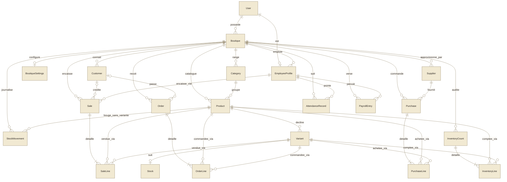
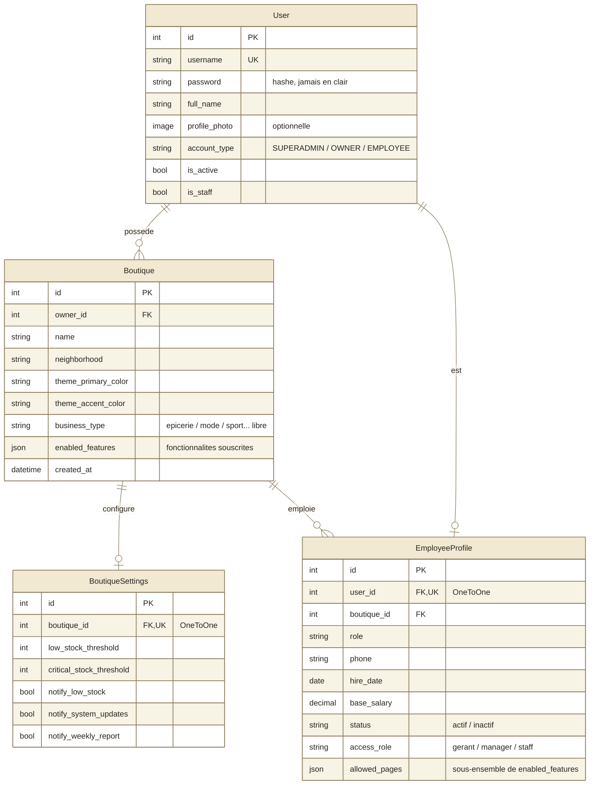
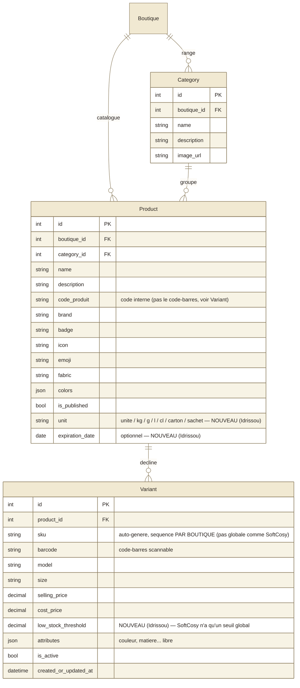
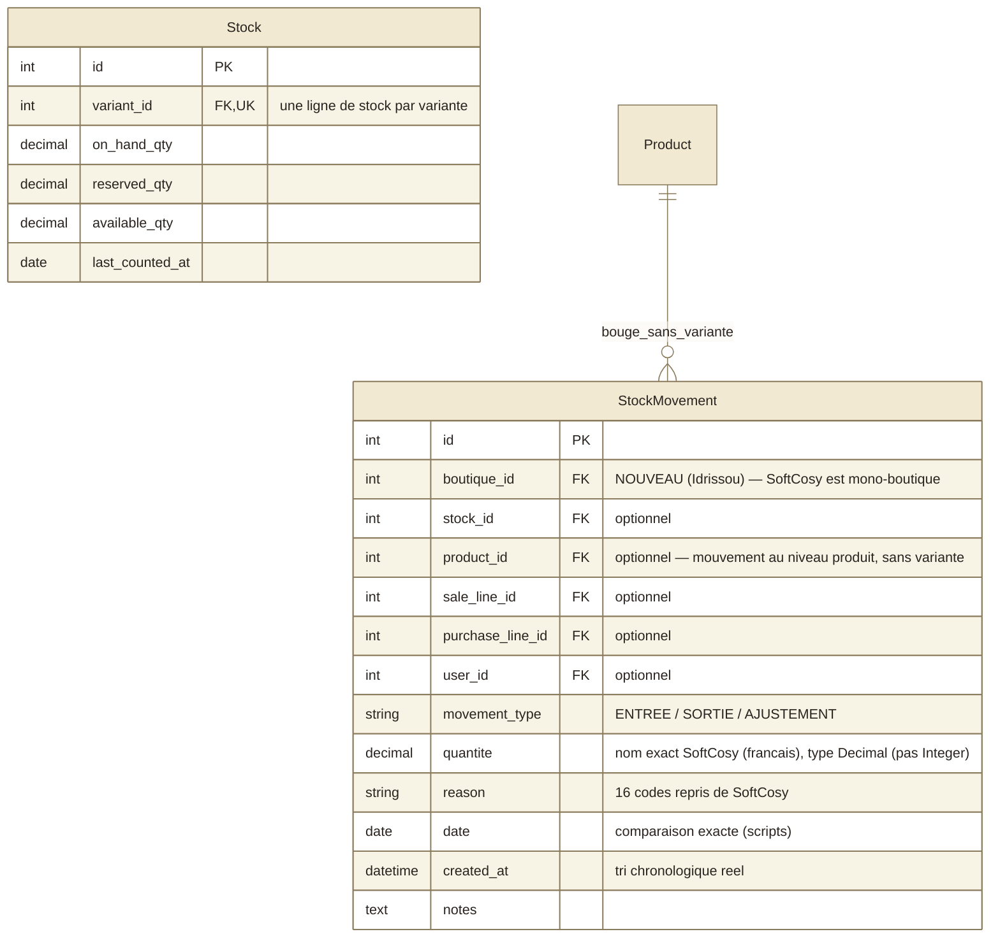
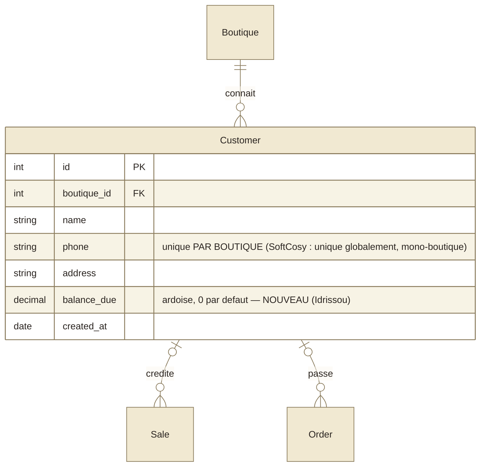
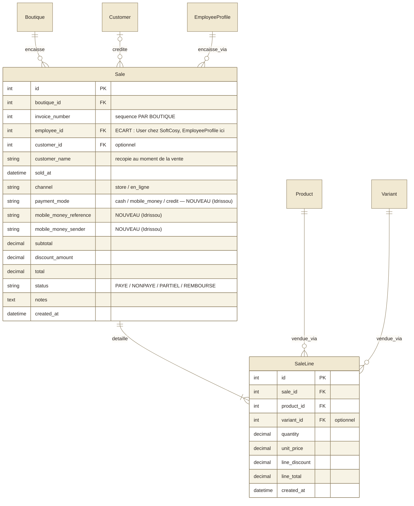
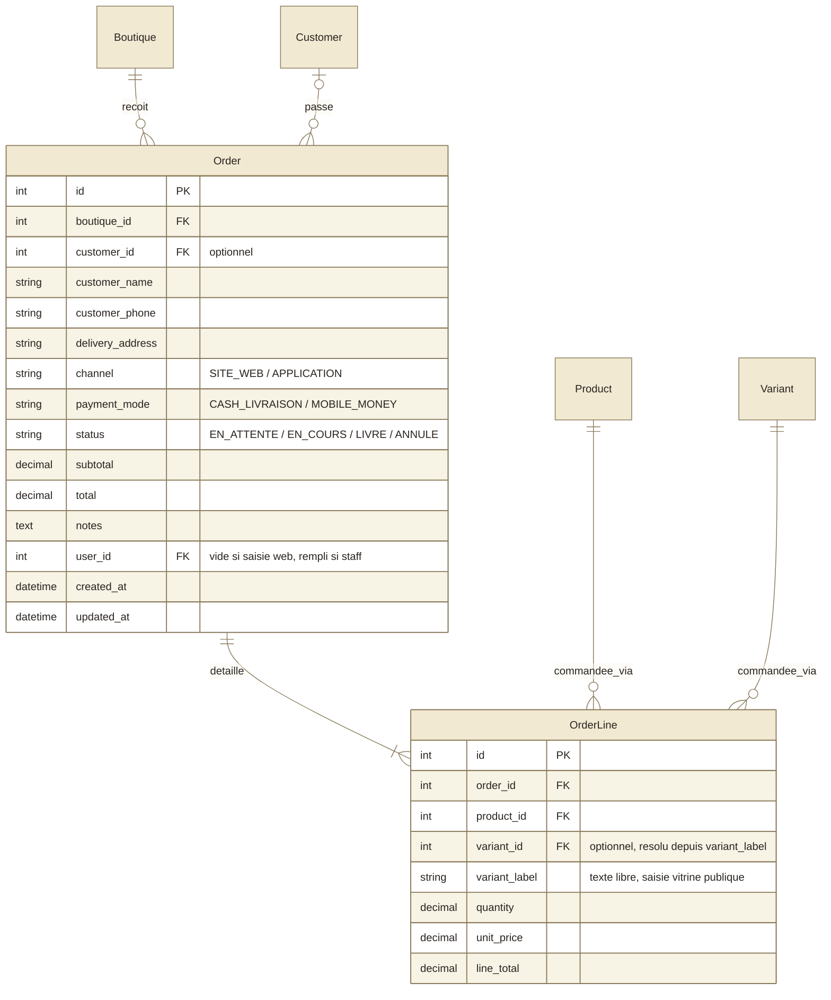
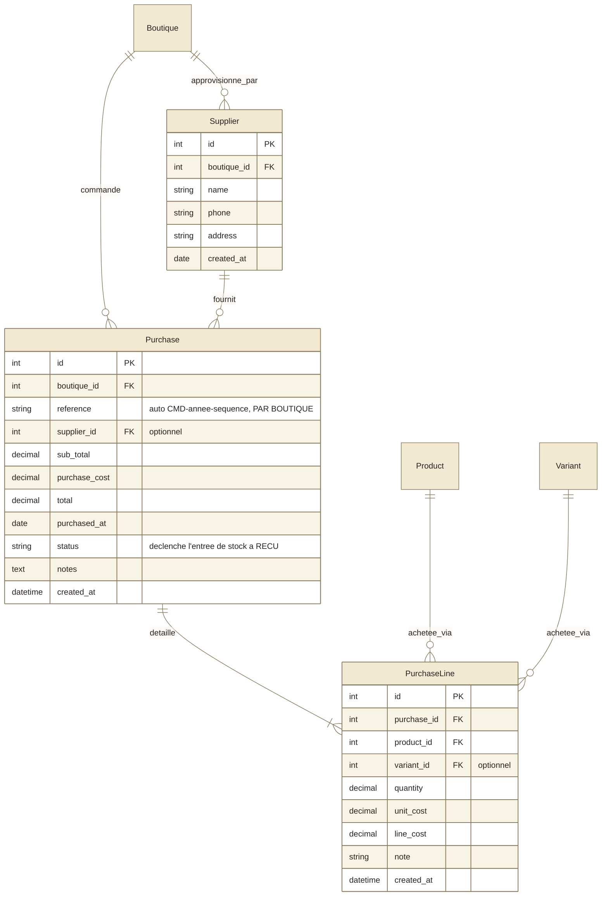
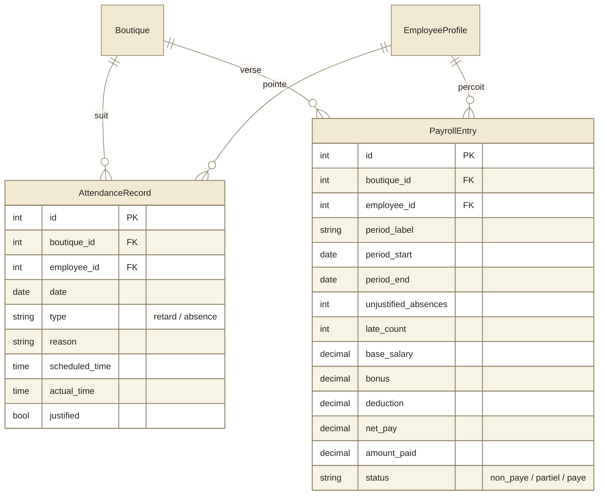
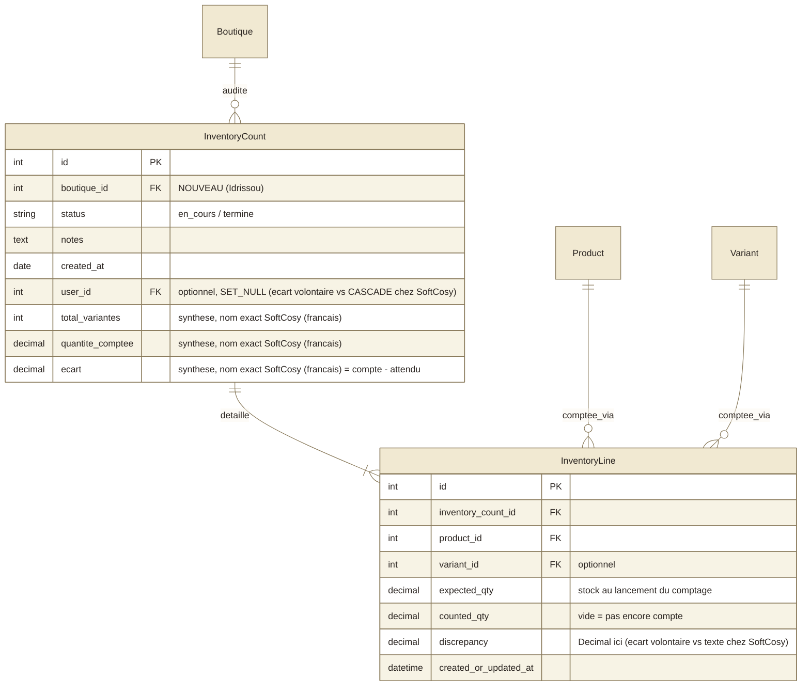

# Registre Plateforme — schéma de données

Schéma unifié pour une plateforme multi-boutique façon Shopify : un seul backend, une seule base, plusieurs boutiques (de types différents) qui souscrivent chacune à leurs propres fonctionnalités. Fusionne le domaine métier déjà en production chez **SoftCosy** (produits à variantes, achats fournisseurs, commandes, inventaire) avec celui construit pour **Chez Idrissou** (cloisonnement multi-boutique, comptes à 3 niveaux, ardoise, paie/présence).

Ce document remplace le précédent schéma « Chez Idrissou seule » — la structure change en profondeur (produits à variantes, catégories par boutique, fonctionnalités à la carte), ce n'est pas une simple extension.

**Cohérence des noms avec SoftCosy** : pour toute entité qui existe dans les deux projets, les noms de champs et de tables reprennent **exactement** ceux de SoftCosy (y compris ses noms en français comme `quantite`, `total_variantes`, `ecart`, et ses tables courtes comme `saleline`, `customerorder`). Les seuls écarts sont marqués explicitly ci-dessous, avec la raison.

## Comment lire ce schéma

| Symbole | Signification |
|---|---|
| `PK` | clé primaire |
| `FK` | clé étrangère |
| `UK` | valeur unique |
| `\|\|` | exactement un |
| `o{` | zéro ou plusieurs |
| `\|{` | un ou plusieurs |
| `o\|` | zéro ou un |

Une entité citée sans liste de champs est définie dans un autre domaine — elle n'apparaît que pour montrer le lien.

Neuf domaines, vingt-et-une entités :

- **Comptes & boutiques** — qui se connecte, à quelle boutique il appartient, et ce que cette boutique a activé.
- **Catalogue** — produits et leurs déclinaisons (taille, couleur...), catégories propres à chaque boutique.
- **Stock** — niveau de stock par déclinaison, et chaque mouvement qui l'a fait bouger.
- **Clients** — annuaire partagé entre ventes comptoir et commandes, avec ardoise optionnelle.
- **Ventes** — une vente comptoir, ses lignes, son mode de paiement.
- **Commandes** — commande à livrer (site web ou saisie manuelle), cycle de vie distinct d'une vente.
- **Achats** — fournisseurs et commandes fournisseurs, qui réapprovisionnent le stock.
- **RH & paie** — présence, retards, salaire net calculé.
- **Inventaire** — stock attendu face au stock compté, écart par déclinaison.

## La pièce nouvelle : fonctionnalités à la carte

`Boutique.enabled_features` est une liste JSON de clés — exactement le même principe que `EmployeeProfile.allowed_pages` (un employé n'a que les pages qu'on lui coche), mais au niveau boutique : une boutique n'a que les fonctionnalités auxquelles elle a souscrit. Catalogue fusionné (le `PAGES`/`ALL_PAGES` de SoftCosy et Idrissou réunis) :

`dashboard, products, stocks, cashier, sales, orders, customers, employees, attendance, payroll, inventory, suppliers, purchases, reports, settings`

Un `OWNER` n'a plus un accès illimité par défaut (contrairement à l'ancien schéma Idrissou seul) : il a accès à tout ce que **sa** boutique a activé, ni plus ni moins. Seul `SUPERADMIN` (exploitant de la plateforme) voit tout, toujours.

## Vue d'ensemble

## Comptes & boutiques

Un seul `User` pour les trois rôles ; `EmployeeProfile` ne s'ajoute que pour les employés. `BoutiqueSettings` (1-1) reprend les champs de `SystemSettings` de SoftCosy à l'identique, mais par boutique — chez SoftCosy c'était une ligne unique partagée par tout le monde, incompatible avec plusieurs boutiques indépendantes (nom de table différent en conséquence : `boutiquesettings`, pas `systemsettings`).

## Catalogue

`Category` passe de globale (Idrissou seul) à **propre à chaque boutique** : une épicerie et une boutique de mode n'ont aucune catégorie en commun — mais garde les champs `description`/`image_url` de SoftCosy. `Product` récupère `code_produit` (nom exact SoftCosy — pas `barcode`, qui reste sur `Variant` comme chez SoftCosy). `Product` + `Variant` reprend le modèle SoftCosy tel quel — un produit simple (épicerie) n'a qu'une seule variante par défaut, un produit à déclinaisons (mode) en a plusieurs.

## Stock

`Stock` reste par variante (noms de champs identiques à SoftCosy). `StockMovement` reprend les 16 raisons de SoftCosy, son champ `quantite` (en français dans le code SoftCosy — pas `quantity`), sa liaison `product` optionnelle pour les mouvements sans variante encore assignée, et ses deux champs de date (`date` pour comparaison exacte par des scripts, `created_at` pour le tri chronologique réel) — gagne seulement `boutique_id`, absent chez SoftCosy (mono-boutique). Jamais de mouvement écrit à la main sur `Stock` — toujours via `StockMovement`.

## Clients

## Ventes

Vente comptoir immédiate — pas de cycle de livraison (voir Commandes). `channel` (où) + `payment_mode` (comment) + `status` (où en est le paiement) sont trois axes distincts. `status` inclut `REMBOURSE`, corrigeant une incohérence relevée chez SoftCosy (utilisé dans le tableau de bord mais absent des choix du modèle). **Écart volontaire** : `employee_id` remplace le `user_id` de SoftCosy — seul un compte Employé peut encaisser (règle déjà construite côté Idrissou), donc pointer vers `EmployeeProfile` plutôt que le `User` brut est plus précis ici.

## Commandes

Nouveau pour Idrissou, repris de SoftCosy tel quel (y compris `user_id` — un propriétaire peut aussi saisir une commande manuellement, pas seulement un employé, donc pas le même écart que sur `Sale`). Cycle de livraison distinct d'une vente (`EN_ATTENTE → EN_COURS → LIVRE/ANNULE`). `variant_label` reste du texte libre — la vitrine publique ne connaît qu'une taille/couleur choisies, pas la variante exacte ; la résolution vers un vrai `Variant` se fait côté serveur, avec repli sur ce texte si elle échoue.

## Achats

Nouveau pour Idrissou, repris de SoftCosy. Passer une commande fournisseur au statut « reçu » déclenche automatiquement des `StockMovement` d'entrée — repris tel quel, bon design déjà éprouvé.

## RH & paie

Inchangé depuis Idrissou (SoftCosy n'a ni présence ni paie).

## Inventaire

Garde la mécanique Idrissou (finalisation = pose des `StockMovement` d'ajustement) et reprend les champs de synthèse de SoftCosy sur l'en-tête avec leurs noms exacts (`total_variantes`, `quantite_comptee`, `ecart` — en français dans le code SoftCosy). **Écart volontaire** : `ecart`/`discrepancy` en `Decimal`, pas en texte comme chez SoftCosy (`"+3"`/`"OK"`, illisible pour un calcul) ; `ecart = compte - attendu`, sans l'incohérence relevée chez SoftCosy entre le commentaire du champ et le calcul réel du sérialiseur ; `user_id` en `SET_NULL` plutôt que le `CASCADE` de SoftCosy (supprimer un compte ne doit pas supprimer l'historique des inventaires, comme partout ailleurs dans ce schéma).

## Pourquoi ce schéma, pas un autre

### Produit + Variante fusionnés, pas deux modèles séparés

Une épicerie vend des produits simples (un sac de riz, une variante unique) ; une boutique de mode vend des déclinaisons (taille, couleur). Plutôt que deux systèmes de catalogue différents, le modèle Produit/Variante de SoftCosy couvre les deux : un produit simple a juste une seule `Variant` par défaut.

### `Category` devient propre à chaque boutique

Chez Idrissou seule, les catégories étaient globales (toutes les boutiques étaient des épiceries, partager « Boissons »/« Épicerie » avait du sens). Sur une plateforme à boutiques de types différents, une épicerie et une boutique de mode n'ont plus aucune catégorie en commun.

### `product_id` gardé À CÔTÉ de `variant_id` sur les lignes (vente, achat, commande, inventaire, mouvement de stock)

Ce n'est pas de la redondance gratuite : chez SoftCosy, `variant` est en `SET_NULL` alors que `product` est en `PROTECT`. Si une variante est supprimée, la ligne garde quand même la trace du produit — sans le doublon, cette information serait perdue.

### `enabled_features` sur `Boutique`, en plus de `allowed_pages` sur `EmployeeProfile`

Deux niveaux : ce que la boutique a souscrit (`enabled_features`), et ce qu'un employé précis peut utiliser parmi ce qui est souscrit (`allowed_pages`, déjà construit). Un `OWNER` n'a plus un accès illimité par défaut — seul `SUPERADMIN` (exploitant plateforme) voit tout.

### `Decimal` partout pour les quantités, jamais `Integer`

SoftCosy utilise des entiers (articles vendus à l'unité). Idrissou a besoin de fractions (kg, litres). La plateforme doit supporter les deux boutiques à la fois — mêmes noms de champs que SoftCosy, mais type `Decimal`.

### `sku`/`invoice_number`/`reference` : séquences PAR BOUTIQUE, pas globales

Chez SoftCosy (mono-boutique), un compteur global suffisait. Sur la plateforme, deux boutiques différentes doivent chacune pouvoir avoir leur propre `SKU-00001` sans collision.

## Hors périmètre, pour l'instant

Pas de site vitrine public multi-tenant dans ce schéma (la résolution de variante depuis une saisie texte libre, `OrderLine.variant_label`, est prévue mais son API reste à construire). Pas de gestion de plans tarifaires/abonnement de la plateforme elle-même — `enabled_features` est une liste ouverte, pas encore reliée à une facturation.

## Et ensuite

Étape 2 traduit ce schéma en modèles Django (une app par domaine ci-dessus) + migrations. Étape 3 reconstruit l'API REST par-dessus (sérialiseurs/vues), adaptée au nouveau schéma — travail séparé, pas fait dans la même session que les modèles.
